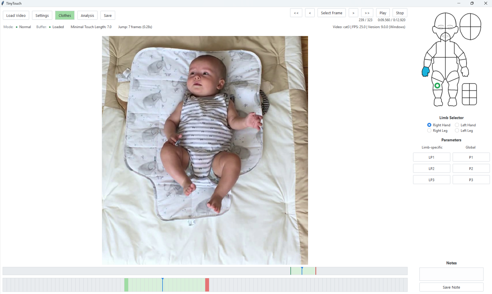

# TinyTouch

Frame-by-frame annotation of infant self-touch, for behavioral research.



   

## What it does

TinyTouch is a desktop tool for coding self-contact in infant video: for each frame you
mark which limb (left/right hand, left/right leg) touches which body zone, together with
the onset and offset of the episode, the infant's gaze, and up to six user-defined
parameters. Contact locations are entered by clicking a body diagram and resolved to zone
names automatically. Each labeled video produces a flat CSV dataset plus a JSON metadata
sidecar, ready for statistical analysis.

## Install

Download the ZIP for your system from the
[Releases page](https://github.com/Humanoids-CTU/tiny-touch/releases), extract it anywhere, and
run the executable inside — `TinyTouch-<tag>.exe` on Windows, `TinyTouch-<tag>` on Linux.
No installation step and no Python required.

Three builds are published per release: `windows-x64` (Windows 10/11, 64-bit), `linux-x64`
(current distributions) and `linux-legacy-x64` (older glibc; built on Debian Bullseye). On
Linux, launch from a terminal so you can see the log.

> **Start new projects with this release.** Previously coded projects are not
> imported or upgraded. Keep them as archives and use a fresh data folder.
> The CSV and metadata export formats remain compatible with existing analysis scripts.

<details>
<summary><b>Run from source</b></summary>

Requires Python 3.12 and [uv](https://docs.astral.sh/uv/). On Debian/Ubuntu you also need
the Tk bindings: `sudo apt install python3.12-tk`.

```bash
git clone https://github.com/Humanoids-CTU/tiny-touch.git
cd tiny-touch
uv venv
uv pip install -r requirements.txt
uv run python src/main.py
```

Build a standalone executable with `uv run pyinstaller TinyTouch.spec`; the result lands in
`dist/`. Run the test suite with `uv run pytest` (GUI end-to-end tests are excluded by
default; add `-m gui` to include them).

</details>

## Quick start

1. **Load Video** — choose `Normal` or `Reliability`, choose a body template, then pick the video file. TinyTouch
   copies it into `videos/` and extracts every frame into `data/<video>/frames/`. This runs
   once per video and can take several minutes.
2. **Clothes** — mark the body zones covered by clothing. Saved with the project and
   recorded in the export metadata.
3. **Select a limb** with the radio buttons under the diagram.
4. **Mark the onset** — navigate to the first frame of the contact and **left-click** the
   body diagram where the touch occurs. A green dot appears.
5. **Mark the offset** — navigate to the first frame after the contact ends and
   **right-click** the same area. A red dot appears and the episode is closed.
6. **Add gaze and parameters** with the buttons on the right; type per-frame remarks in the
   note box and click **Save Note**.
7. **Save** — writes `data/<video>/export/<video>_export.csv` and
   `data/<video>/export/<video>_metadata.json` identifying the
   body template as `"template": "default"` or `"alternate"`. Keep these two files together. TinyTouch also saves on close.

The template picker applies to new projects. Existing projects restore their saved
template, and Reliability inherits the original project's template. **Settings** shows the active
template and allows a change only before annotation begins. The first annotation or
clothing mark permanently locks it, including if that mark is later deleted. The Clothes
window and analysis use the same template. See [project template provenance](docs/DATA_FORMAT.md#2-the-metadata-sidecar).

Working projects use schema 2 and must have a recorded template. Unsupported projects
are rejected without conversion. You can reopen projects created by this release normally.

| Input | Action |
| --- | --- |
| `←` / `→` | Previous / next frame |
| `Shift`+`←` / `Shift`+`→`, `<<` / `>>` | Fast jump back / forward |
| Mouse wheel | Previous / next frame |
| `Space`, **Play** / **Stop** | Toggle playback |
| Left-click on diagram | Touch onset (green dot) |
| Right-click on diagram | Touch offset (red dot) |
| Middle-click on diagram, or `d` | Delete the nearest dot |
| Click a timeline | Jump to that frame |
| **Save** | Write the working state and the export |

The full coding manual — modes, zones, parameters, and the mistakes worth avoiding — is in
[docs/ANNOTATION_GUIDE.md](docs/ANNOTATION_GUIDE.md).

## Output data

Each labeled video gets a self-contained folder:

```
data/<video>/
├── export/     <video>_export.csv + <video>_metadata.json
├── state/      <video>.db          working state, internal
├── frames/     frame0.jpg …        extracted video frames
└── plots/                          analysis dashboards
```

Keep the three files under `export/` together when sharing the published dataset.
The CSV has one row per frame with per-limb coordinates, onset/offset markers and zone
lists; the JSON records program version, frame rate, labeling mode, clothing zones,
parameter labels and total labeling time. The project JSON records the versioned body
template; see [docs/DATA_FORMAT.md#2-the-metadata-sidecar](docs/DATA_FORMAT.md#2-the-metadata-sidecar).

**The export format is unchanged from earlier TinyTouch versions** — same columns, same
order, same cell encoding — so existing analysis pipelines keep working. The full
specification, including the semantics analysis code must follow, is in
[docs/DATA_FORMAT.md](docs/DATA_FORMAT.md).

## Analysis

The **Analysis** button computes per-limb statistics from the export and writes an
interactive Plotly dashboard to `data/<video>/plots/`, opening it in your browser: touch
counts and durations, percentage of time in contact, touch rate, zone-transition heatmaps
per limb, a click-trajectory plot drawn over the limb diagrams, and duration/onset
histograms. Touches left without an offset are reported separately as censored and excluded
from duration statistics.

## Citing

A paper describing TinyTouch is in preparation. Until it appears, please cite the software
by its repository URL and the version string recorded in your dataset's metadata sidecar
(`Program Version`).

An example of the kind of analysis this coding scheme supports:

> Khoury, J., Popescu, S. T., Gama, F., Marcel, V. and Hoffmann, M. (2022), Self-touch and
> other spontaneous behavior patterns in early infancy, in *IEEE International Conference
> on Development and Learning (ICDL)*, pp. 148-155.
> [PDF](https://drive.google.com/file/d/1iVgMr-8eJFPH8jU31ksDNmv4xWY_4s5q/view?usp=sharing)

## License

Copyright (c) 2026 Czech Technical University in Prague.

TinyTouch's source code, tests, build scripts, configuration files, documentation,
and original artwork (including body diagrams and zone masks) are licensed under
the GNU General Public License, version 3 or (at your option) any later version
(`GPL-3.0-or-later`). See [LICENSE](LICENSE) for the full terms.

You may use, modify, and distribute the software, including commercially, under those
terms. When distributing binaries, provide the corresponding source code as required
by the GPL. Recipients retain the right to modify and redistribute their copies.
The software comes without warranty, to the extent permitted by applicable law.

[REUSE.toml](REUSE.toml) records file-level copyright and license notices.
Third-party components retain their respective licenses. This project license does
not impose a license on users' input videos or annotation datasets.
Earlier releases offered under CC BY 4.0 remain available under those terms.

## Contact

Developed at the Vision for Robotics and Autonomous Systems (VRAS) group, Czech Technical
University in Prague.

Maintainer: navarlu2@fel.cvut.cz

## Reporting a problem

TinyTouch writes one diagnostic log for every session. Open **Settings -> Open Logs
Folder**, then attach the newest `tinytouch_*.log` file to the bug report. The log includes
application details, errors, and the local annotation activity--including note text--needed
to understand what happened. It stays on your computer and is never transmitted
automatically.

If a log file cannot be created, TinyTouch continues running and reports diagnostics in
the terminal window instead.

## Documentation

[Annotation guide](docs/ANNOTATION_GUIDE.md) for annotators, [data format](docs/DATA_FORMAT.md)
for data consumers, [ARCHITECTURE.md](ARCHITECTURE.md) for developers, and a
[full index](docs/README.md) of everything else.
